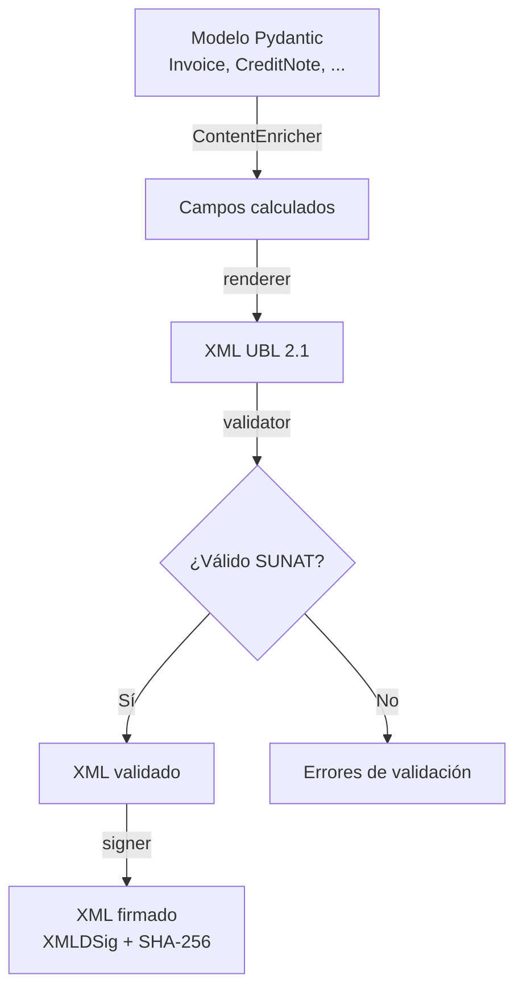
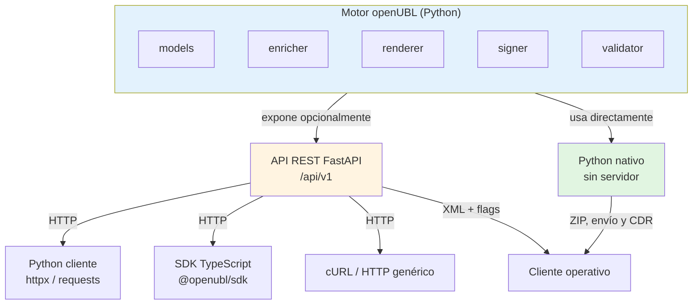
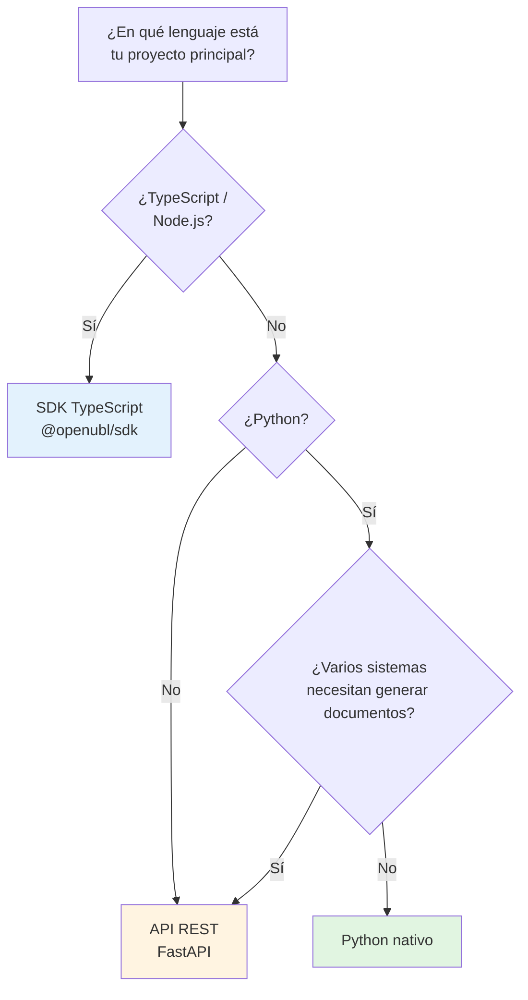

openUBL es, ante todo, un **motor Python** para generar, firmar y validar documentos electrónicos UBL 2.1. Sobre ese motor se monta una **API REST opcional** con FastAPI. Los clientes pueden consumir la API desde cualquier lenguaje, o bien usar directamente la biblioteca Python sin levantar ningún servidor.

## El motor openUBL

El paquete Python (`src/openubl`) contiene el núcleo del proyecto. Cada capa tiene una responsabilidad clara y se puede usar de forma independiente cuando trabajas en modo **Python nativo**:

- **`openubl.models`** — Modelos Pydantic para `Invoice`, `CreditNote`, `DebitNote`, `VoidedDocuments`, `SummaryDocuments`, `Perception`, `Retention` y sus tipos auxiliares. Valida los datos de entrada y define la estructura del XML resultante.
- **`openubl.enricher`** — `ContentEnricher` calcula campos faltantes: totales, impuestos (IGV, ICBPER), precios de venta y valores por ítem.
- **`openubl.renderer`** — Convierte un modelo en XML UBL 2.1 mediante plantillas Jinja2 (`render_invoice`, `render_credit_note`, etc.).
- **`openubl.signer`** — Firma digital XMLDSig con certificado X.509 y clave privada en formato PEM (`sign_ubl_xml`). Usa RSA-SHA-256 y SHA-256 según INDECOPI/IOFE y la Directiva PCM 002-2024.
- **`openubl.validator`** — `SunatValidator` aplica reglas y esquemas XSD de SUNAT sobre el XML generado.
Este motor funciona como biblioteca nativa: importas, creas el modelo, enriqueces, renderizas, firmas y validas sin necesidad de red. El empaquetado ZIP, envío a SUNAT y recepción del CDR quedan fuera del servidor: son responsabilidad del cliente operativo.

### Flujo de procesamiento de un documento

## La API REST

FastAPI expone el motor bajo `/api/v1` a través de endpoints que reciben JSON, enriquecen automáticamente, renderizan y, opcionalmente, firman y validan:

- `POST /api/v1/invoice/create`
- `POST /api/v1/credit-note/create`
- `POST /api/v1/debit-note/create`
- `POST /api/v1/voided-documents/create`
- `POST /api/v1/summary-documents/create`
- `POST /api/v1/perception/create`

## Diagrama de arquitectura

- El **motor** es la única fuente de verdad para la lógica UBL, firma y validación.
- La **API REST** es una envoltura opcional: si no la levantas, el motor sigue funcionando.
- **Python nativo** accede directamente al motor; los demás modos acceden a través de la API REST.
- El **empaquetado ZIP, envío a SUNAT y recepción del CDR** son responsabilidad del cliente operativo; no forman parte de openUBL Server.

## Modos de uso

openUBL ofrece cuatro formas de integrarse, agrupadas por si requieren servidor o no.

### 1. Python nativo

Usas `openubl.models`, `ContentEnricher`, `render_invoice` y `sign_ubl_xml` directamente desde tu código Python.

- **Requiere servidor:** no.
- **Cuándo usarlo:** backend Python donde quieres generar XML localmente y controlar todo el flujo.

### 2. Python cliente HTTP

Desde Python usas `httpx`, `requests` u otro cliente HTTP para llamar a `http://localhost:8000/api/v1/...`.

- **Requiere servidor:** sí.
- **Cuándo usarlo:** quieres mantener la lógica de generación centralizada en el servicio openUBL pero tu aplicación principal está en Python.

### 3. SDK TypeScript

Usas el paquete npm `@openubl/sdk`, generado desde `openapi.json`, que ofrece funciones tipadas y validación Zod.

- **Requiere servidor:** sí.
- **Cuándo usarlo:** tu proyecto está en Node.js, Deno o Bun y prefieres autocompletado y tipado estático.

### 4. cURL / HTTP genérico

Llamas directamente a los endpoints REST con cualquier herramienta HTTP.

- **Requiere servidor:** sí.
- **Cuándo usarlo:** pruebas rápidas, scripts shell, Postman o integración desde un lenguaje sin SDK oficial.

## ¿Qué modo elegir?

:::tip[¿Por dónde continuar?]
- Si usas **Python nativo**, salta directamente a [Tu primer documento](/openUBL/getting-started/primer-documento/).
- Si usas **cURL, SDK TypeScript o Python vía HTTP**, primero [levanta el servidor](/openUBL/getting-started/levantar-servidor/).
:::
