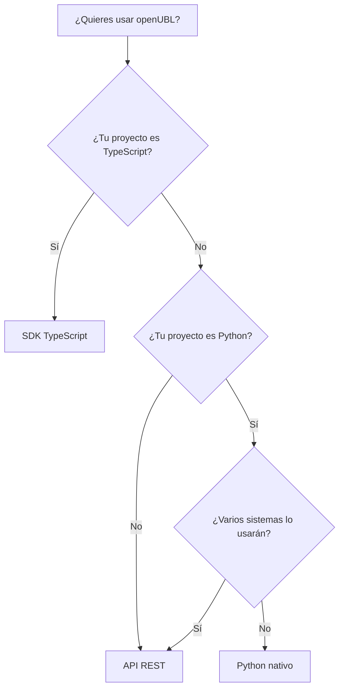

openUBL se puede usar de tres maneras. Esta página te ayuda a elegir la más adecuada en menos de dos minutos.

## Tabla de decisión

| Tu contexto | Modo recomendado | Razón |
|---|---|---|
| Tu proyecto es Python y no necesitas compartir la lógica | Python nativo | No necesitas levantar un servicio ni mantener HTTP. |
| Tu proyecto es TypeScript/Node.js | SDK TypeScript | Tipado completo, autocompletado y validación Zod. |
| Varios sistemas necesitan generar documentos | API REST | Centralizas validación, firma y enriquecimiento en un solo lugar. |
| Necesitas firmar XML localmente | Python nativo o API REST | La firma requiere acceso al certificado y la clave privada. |
| Quieres probar desde curl/Postman | API REST | Los endpoints aceptan JSON y devuelven XML. |
| Equipo pequeño, pocos documentos al día | Python nativo o SDK TypeScript | Menos infraestructura. |
| Equipo grande, alta concurrencia | API REST | Escalas el servicio independientemente de los clientes. |

## Diagrama de decisión



## Ejemplo mínimo de cada modo

### Python nativo

```python
from openubl.models import Invoice, Proveedor, Cliente, DocumentoVentaDetalle
from openubl.enricher import ContentEnricher
from openubl.renderer import render_invoice

invoice = Invoice(
    serie="F001",
    numero=1,
    proveedor=Proveedor(ruc="20100066603", razonSocial="Softgreen S.A.C."),
    cliente=Cliente(nombre="Carlos", numeroDocumentoIdentidad="12121212121", tipoDocumentoIdentidad="6"),
    detalles=[DocumentoVentaDetalle(descripcion="Item", cantidad=10, precio=100)],
)

ContentEnricher().enrich(invoice)
xml = render_invoice(invoice)
print(xml)
```

### API REST

```bash
curl -X POST http://localhost:8000/api/v1/invoice/create \
  -H "Content-Type: application/json" \
  -d '{
    "serie": "F001",
    "numero": 1,
    "proveedor": { "ruc": "20100066603", "razonSocial": "Softgreen S.A.C." },
    "cliente": { "nombre": "Carlos", "numeroDocumentoIdentidad": "12121212121", "tipoDocumentoIdentidad": "6" },
    "detalles": [{ "descripcion": "Item", "cantidad": 10, "precio": 100 }]
  }'
```

### SDK TypeScript

```typescript
import { createInvoice } from "@openubl/sdk";
import { zInvoice } from "@openubl/sdk/zod.gen";

const invoice = zInvoice.parse({
  serie: "F001",
  numero: 1,
  proveedor: { ruc: "20100066603", razonSocial: "Softgreen S.A.C." },
  cliente: { nombre: "Carlos", numeroDocumentoIdentidad: "12121212121", tipoDocumentoIdentidad: "6" },
  detalles: [{ descripcion: "Item", cantidad: 10, precio: 100 }],
});

const { data, error } = await createInvoice({ body: invoice });
if (error) throw new Error(JSON.stringify(error));
console.log(data.xml);
```

## ¿Y después?

- Si elegiste **Python nativo**, empieza con [Tu primer documento](/openUBL/getting-started/primer-documento/).
- Si elegiste la **API REST**, **Python vía HTTP** o **cURL**, primero [instala Python](/openUBL/getting-started/instalar-python/) y luego [levanta el servidor](/openUBL/getting-started/levantar-servidor/).
- Si elegiste el **SDK TypeScript**, instálalo desde la [guía del SDK](/openUBL/sdk/instalacion/) y asegúrate de tener el [servidor levantado](/openUBL/getting-started/levantar-servidor/).
- Si tienes dudas durante la integración, consulta la [guía de troubleshooting](/openUBL/guides/troubleshooting/).
